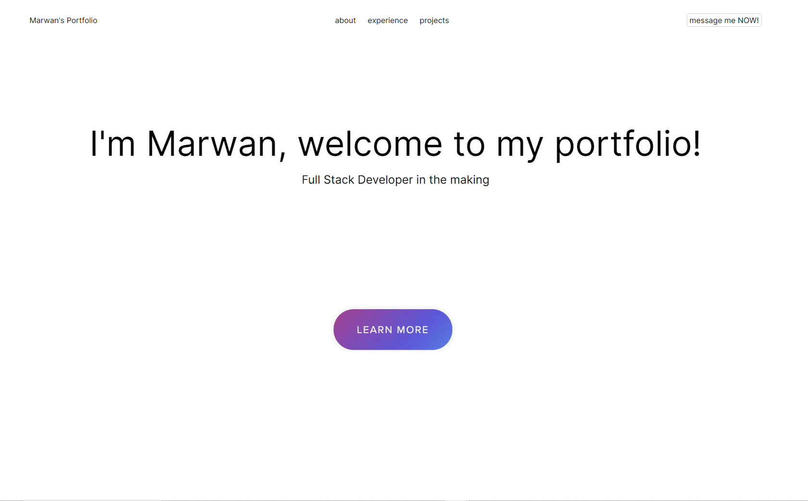

# Marwan Mostafa's Portfolio

## Description

This is the Module 2 challenge for the second week of the UCB Coding Bootcamp. For this challenge we were asked to create a website from scratch with no starter code. The website features clickable nav bar elements that smooth scroll to the desired sections and functional links to the github repositories. I've also included some work history for now.

## Project Link

[github io link](https://marwanfmostafa.github.io/Portfolio/)

## Screenshot of Website

## Usage

This can be used as a way to introduce and advertise myself to potential employers because it will be updated with projectrs I've completed as well as furture projects.

## Credits

N/A

## License

N/A
